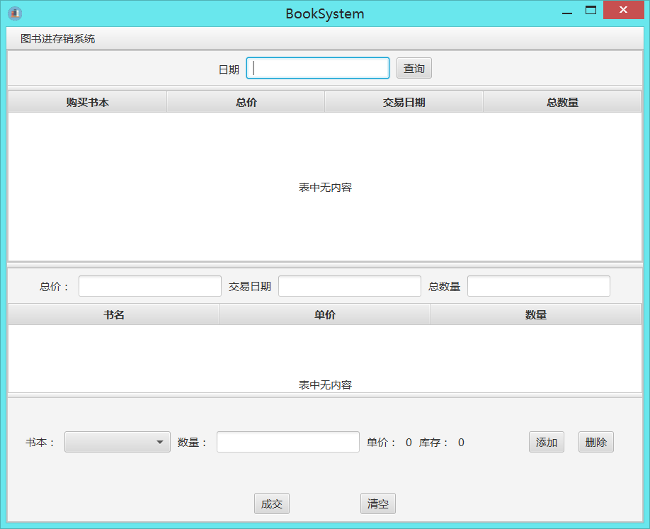

# BooksystemFX

## Overview

This is a system that is used to manage books. And in this project I used the javafx to implement the user interface. And the database that I used is Mysql, the persistence framework is mybatis. Of course, It's not an real application. It's just a small application I write for fun.

## Screenshots

​	

